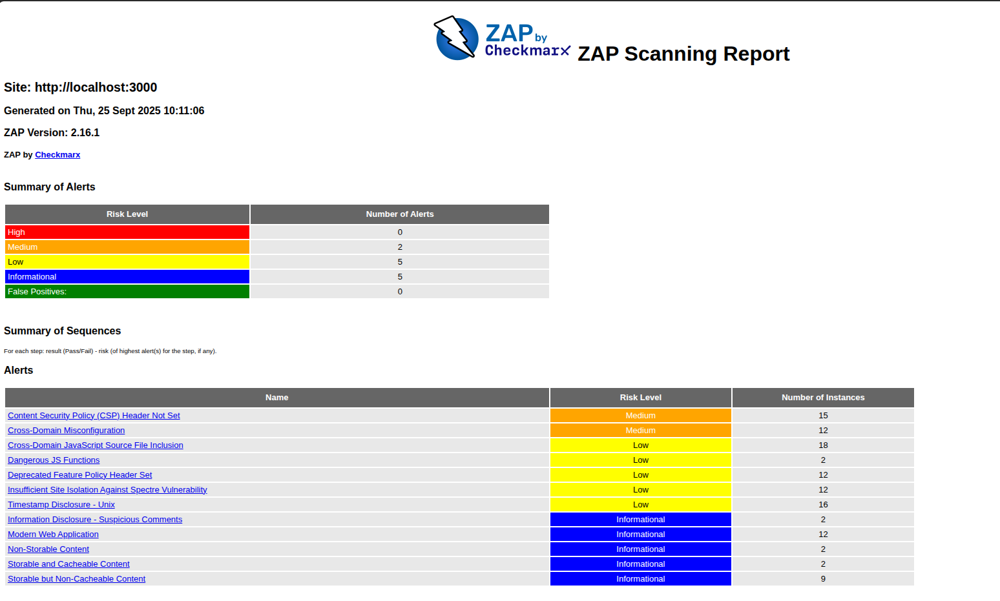

# Day 2 — OWASP ZAP: Detecting & Understanding Web Vulnerabilities

## Objective

## Pull & run the target app (Juice Shop) locally

```bash
# pull the image (optional if you already pulled)
docker pull bkimminich/juice-shop:latest

# run the app as a background container
docker run -d --name juice -p 8080:3000 bkimminich/juice-shop:latest

# verify it is up (open in browser)
http://localhost:8080

```

---

## CI/CD Pipeline Integration

A GitHub Actions workflow (.github/workflows/zap_scan.yml) automates the OWASP ZAP security scan on branches main with paths 'Security_Compliance_workshop-dhiraj/day2/**'. It checks out the code, runs the scan against the target application, and uploads the HTML report as an artifact, ensuring security testing is seamlessly integrated into the development process.



## Core concept answers
### 1. What is the purpose of DAST and how does it complement other security testing methods?
DAST (Dynamic Application Security Testing) is a black-box testing method that analyzes a running application to find vulnerabilities without access to the source code. It simulates external attacks to identify issues like:

SQL injection
Cross-site scripting (XSS)
Authentication flaws
Server misconfigurations

### How it complements other methods:

SAST (Static Application Security Testing): SAST analyzes source code before the application runs. DAST complements it by catching runtime issues that SAST might miss, such as misconfigured servers or broken authentication flows.
IAST (Interactive Application Security Testing): IAST combines elements of SAST and DAST during runtime. DAST complements IAST by providing broader external attack simulation.
Penetration Testing: DAST automates many of the tests that a manual pen test would perform, making it useful for frequent scans between manual assessments.

### 2. Explain how XSS or SQL injection vulnerabilities can affect an application and its users.
Cross-Site Scripting (XSS):

Impact on users: Attackers inject malicious scripts into web pages viewed by other users. These scripts can steal session cookies, redirect users, or deface content.
Impact on applications: XSS can lead to unauthorized actions on behalf of users, data leakage, and reputational damage.

SQL Injection:

Impact on users: Attackers can manipulate database queries to access or modify sensitive user data.
Impact on applications: SQL injection can result in data breaches, deletion of records, unauthorized access, and even full database compromise.

### 3. Describe the steps you would take to fix the vulnerabilities detected in your ZAP scan.


- Review the ZAP Report:

    Identify high, medium, and low severity issues.
    Understand the context and affected endpoints.


- Prioritize Fixes:

    Focus on high-risk vulnerabilities like SQL injection, XSS, and authentication flaws.


- Remediate Code Issues:

    For XSS: Sanitize and validate user inputs, use secure frameworks, and implement Content Security Policy (CSP).
    
    For SQL Injection: Use parameterized queries or ORM frameworks, avoid dynamic SQL.


- Update Dependencies:

    Patch outdated libraries or frameworks that may be vulnerable.


- Re-test:
    
    Run ZAP again to confirm fixes.
    Consider manual testing for critical areas.


- Document and Monitor:

    Keep records of fixes and monitor for recurring issues.

### 4. How does integrating ZAP scans into CI/CD pipelines support shift-left security practices?

Shift-left security means integrating security early in the development lifecycle. By embedding ZAP scans into CI/CD:

- Early Detection: Vulnerabilities are caught during development, not after deployment.

- Automation: Security testing becomes part of the build process, reducing manual effort.

- Faster Remediation: Developers fix issues while the code is fresh, minimizing context switching.

- Continuous Feedback: Regular scans ensure new code doesn’t introduce regressions.

- DevSecOps Alignment: Encourages collaboration between development, security, and operations teams.